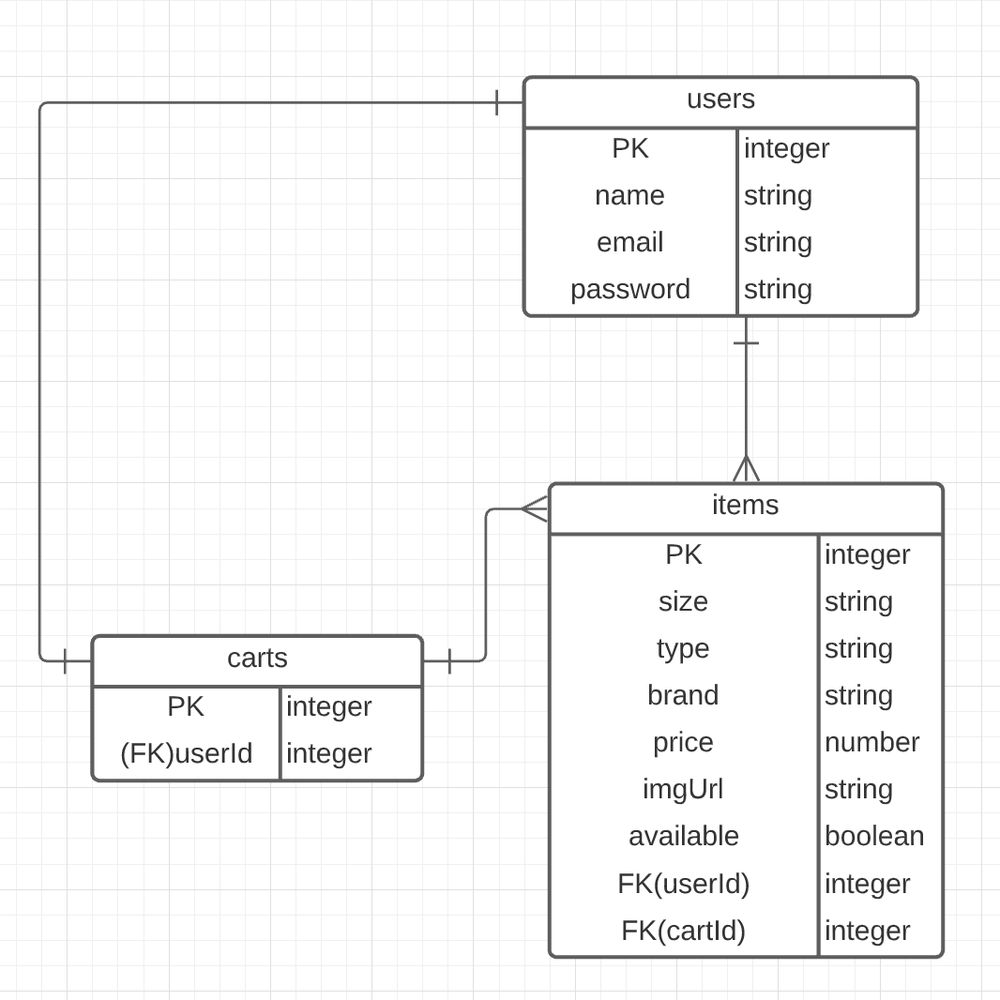
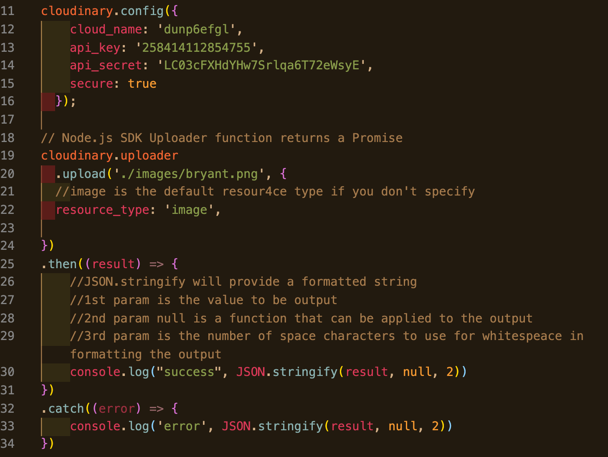
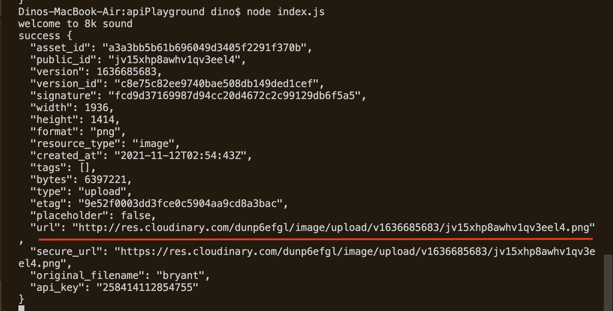

# Thrifted
Thrifted is a plus-sized focused platform that enables users to buy and sell second-hand clothing.

---
## Tech Stack
The thrifted app will be built with the PEN stack: PotgresSQL, Express, and Node.JS.

## Wireframes

## API 
Thrifted will utilize cloudinary's [upload API](https://cloudinary.com/documentation/image_upload_api_reference) to generate url's that host the images for items in the Thrifted store.

## ERD

## API Invocation

Using the uploader function from cloudinary's node package, I am able to send a local photo to be uploaded and hosted at a unique url through cloudinary.
## API Response

When the API is invoked with the upload function, it returns a JSON object containing the url that will be used to render photos of items in the Thrifted store.

## MVP Goals
* Users browse an index of items which they can add and remove from their cart
*  Users can create new items and "sell" by adding them to their store
* Users can attach an image to the items that they add
* Users can delete items from their store (removed from their store AND the items db)
## Stretch Goals
* Utilize cloudinary's upload widget Api
* Users can filter by size when browsing the index of items
* Users can add multiple photos when creating an item

## Potential Roadblocks
I believe the photos will prove to be the most difficult part of using this app. For one, photos taken on an iPhone are often stored as .heic files and I am unsure if this API can handle photo's that aren't in the .jpeg or .png format. Additionally, users may try to upload photos with a plethora of unique proportions and dimensions. Trying to render this photos cleanly on the webpage could be challenging.

