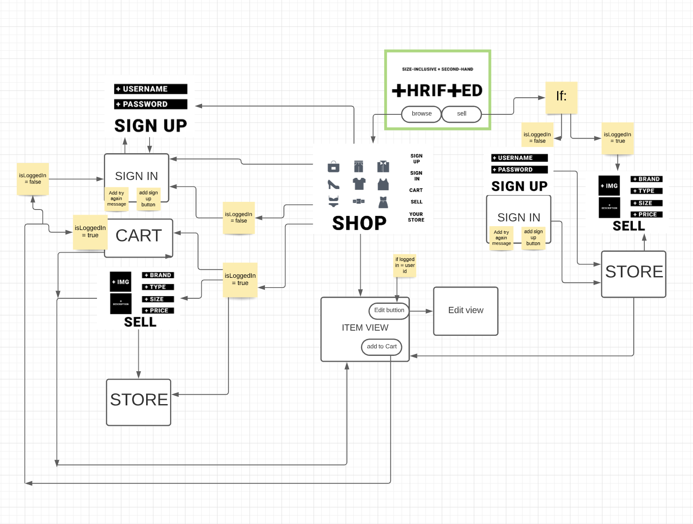
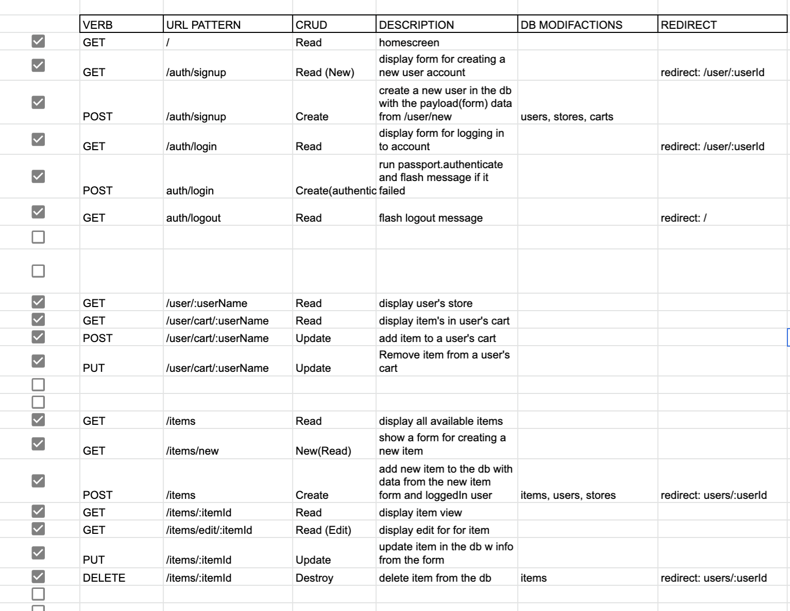
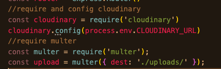
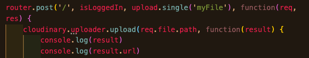

# Thrifted
Thrifted is a plus-sized focused platform that enables users to buy and sell second-hand clothing. In this MVP, users create an account to browse available items, and can sell their own by uploading an image and providing a few details. Once uploaded for sale, these items can be edited by their seller. Users can click on items' thumbnails for a closer look, and are able to add items to their cart from this view or the thumbnail. Items can only be added to one cart at a time, so unavailable items area not rendered on the "shop" page.

Visit the latest live version of thrifted [here](https://thrifted-app.herokuapp.com/)

---
## Tech Stack
The thrifted app was built with the PEN stack: PotgresSQL, Express, and Node.JS. Photos arestored through cloudinary's upload API, and styling was completed with Bootsrap.

## Wireframes

## User Journey Through Webpages

## RESTful Routes

## API 
Thrifted will utilize cloudinary's [upload API](https://cloudinary.com/documentation/image_upload_api_reference) to generate url's that host the images for items in the Thrifted store.

## ERD

The user table has a one to many relationship with the items table and a one to one relationship with the carts table. The carts table also has a one to many relationship with the items table, since every cart can have many items, but each item can only be in one cart at this time. This is also why the items table has boolean column labeled, "availabele". When an is placed in a user's cart, "available" is set to "false" so that it will not be rendered with the index of shoppable items.

## API Invocation

Using the uploader function from cloudinary's node package, I am able to send a local photo to be uploaded and hosted at a unique url through cloudinary.
## API Response

When the API is invoked with the upload function, it returns a JSON object containing the url that will be used to render photos of items in the Thrifted store.

## MVP Goals
* Users browse an index of items which they can add and remove from their cart
*  Users can create new items and "sell" by adding them to their store
* Users can attach an image to the items that they add
* Users can delete items from their store (removed from their store AND the items db)
## Stretch Goals
* Utilize cloudinary's upload widget Api
* Users can filter by size when browsing the index of items
* Users can add multiple photos when creating an item

## Potential Roadblocks
I believe the photos will prove to be the most difficult part of using this app. For one, photos taken on an iPhone are often stored as .heic files and I am unsure if this API can handle photo's that aren't in the .jpeg or .png format. Additionally, users may try to upload photos with a plethora of unique proportions and dimensions. Trying to render this photos cleanly on the webpage could be challenging.

